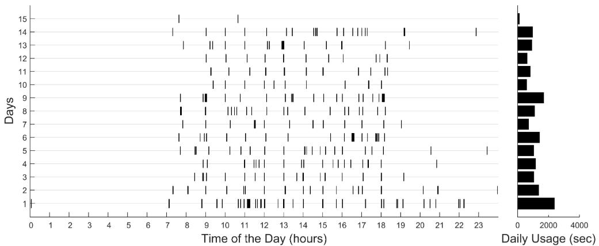
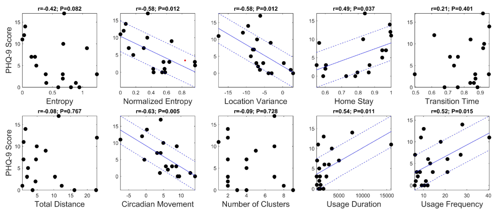
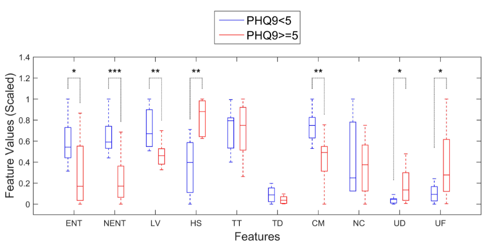

# 논문 제목: Mobile Phone Sensor Correlates of Depressive Symptom Severity in Daily-Life Behavior: An Exploratory Study

-   저자:S Saeb, M Zhang, CJ Karr, SM Schueller, ME Corden, KP Kording, DC Mohr
-   제출년도: 2015
-   학회지: Journal of medical Internet research
-   링크: [PDF\_LINK](https://www.jmir.org/2015/7/e175)
-   TASK: **우울증 중증도 예측**
-   데이터: 자체 데이터
-   모델: logistic regression(우울증 여부), linear regression(PHQ-9 점)

## 1\. 연구 주제 및 목적

-   모바일 폰의 GPS 및 센서를 이용해 일상 생활에서 우울증 증상의 심각도를 식별하는 행동 지표를 탐구
-   이동을 통한 지리적 공간 내 행동 지표와 우울증 증상 심각도 간의 관계

## 2\. 데이터

### GPS 위치 데이터 전처리

-   상태 구분: 각 GPS 위치 데이터 샘플이 정지 상태(예: 사무실에서 작업)인지 이동 상태(예: 길에서 걷기)인지 구분
    -   본 연구에서는 이 임계 속도를 1 km/h로 설정
-   클러스터링: 정지 상태 데이터 샘플에 대해 클러스터링을 수행
    -   목표는 참가자들이 대부분의 시간을 보내는 장소(예: 집, 직장, 공원 등)를 식별하는 것
    -   K-means 알고리즘을 사용하여 데이터 샘플을 클러스터로 분할
    -   클러스터의 수는 미리 알 수 없으므로, 각 클러스터의 중심으로부터 가장 먼 점까지의 거리가 특정 임계값(500미터) 이하가 될 때까지 클러스터 수를 증가시킴

### 폰 사용 데이터 전처리

-   화면 켜짐 이벤트 처리: 폰 화면이 켜진 기간 동안의 데이터를 수집
    -   참가자가 직접 개시하지 않은 짧은 화면 켜짐 이벤트(30초 미만)를 제거하여 실제 사용 이벤트만 남김 

\[한 참가자의 폰 사용 데이터\]

## 3\. 연구 방법

### Feature

#### GPS 위치 데이터로부터 추출된 특성

1.  위치 분산(Location Variance): 참가자의 GPS 위치 변동성을 측정.
    -   계산: 정지 상태의 위치 데이터에서 위도와 경도의 통계적 분산 합의 로그값으로 계산.
2.  클러스터 수(Number of Clusters): K-means 알고리즘으로 식별된 위치 클러스터 수.
3.  엔트로피(Entropy): 참가자가 다양한 위치 클러스터에서 보낸 시간의 변동성을 측정.

-   : 정보 이론의 엔트로피 개념을 기반으로, 클러스터에서 보낸 시간의 비율을 사용해 계산.

4.  된 엔트로피(Normalized Entropy): 엔트로피를 클러스터 수의 로그값으로 나누어 변동성을 정규화.

-   : 엔트로피를 총 클러스터 수의 로그값으로 나누어 계산. 값의 범위는 0에서 1까지.

5.  문 시간(Home Stay): 참가자가 집에서 보낸 시간의 비율.

-   방법: 자주 방문한 상위 3개의 클러스터 중, 밤 12시에서 새벽 6시 사이에 가장 많이 머무른 클러스터를 집으로 식별.

6.  리듬(Circadian Movement): 참가자의 24시간 주기 이동 패턴의 규칙성을 측정.

-   계산: Lomb-Scargle 방법을 사용하여 GPS 데이터의 스펙트럼을 얻고, 24±0.5시간 주기 내 에너지를 계산.

7.  시간(Transition Time): 참가자가 이동 상태에 있는 시간의 비율.

-   계산: 이동 상태의 GPS 샘플 수를 총 샘플 수로 나누어 계산.

8.  거리(Total Distance): 참가자가 이동한 총 거리.

-   계산: 위치 샘플 간의 거리를 누적하여 계산.

#### 폰 사용 데이터로부터 추출된 특성

-   사용 빈도(Usage Frequency): 참가자가 하루 동안 폰과 상호작용한 평균 횟수.
-   사용 시간(Usage Duration): 참가자가 하루 동안 폰과 상호작용한 총 시간.

### 모델

#### 선형 회귀 모델 (Score Estimation Model)

-   PHQ점수 예측

$$  
\\text{Depression Score} = a_0 + a_1F_1 + a_2F_2 + \\ldots + a_nF_n  
$$

#### 로지스틱 회귀 모델 (Classification Model)

-   우울증 유(PHQ 5점 이상)/ 무(PHQ 4점 이하)

$$  
P(\\text{Depressive Symptoms}) = g(b_0 + b_1F_1 + b_2F_2 + \\ldots + b_nF_n)  
$$

$g(x) = \frac{1}{1 + e^{-x}}$

#### 모델 최적화 (Model Optimization)

$$  
H(K, \lambda_1, \lambda_2) = \lambda_1 |K|_1 + \lambda_2 |K|_2  
$$

$K = [k_0, k_1, \ldots, k_n]$

$|K|_1 = \sum_{i=1}^{n} |k_i|$

$|K|_2 = \sqrt{\sum_{i=1}^{n} k_i^2}$

## 4\. 연구 결과

### 참가자 특성 및 데이터 준수

-   총 40명의 참가자가 연구에 참여, 28명이 분석에 충분한 센서 데이터를 제공
-   이들 중 18명은 GPS 위치 데이터, 21명은 전화 사용 데이터 분석에 포함
-   참가자의 PHQ-9 점수는 0에서 17까지 분포, 평균 점수는 5.57

### 피처와 우울증 수준의 관계

0개 특징 중 6개가 PHQ-9 점수와 유의미한 상관관계

-   서카디안 이동(circadian movement): r=−0.63, P=0.005
-   정규화된 엔트로피(normalized entropy): r=−0.58, P=0.012
-   위치 분산(location variance): r=−0.58, P=0.012
-   전화 사용 기간(phone usage duration): r=−0.54, P=0.011
-   전화 사용 빈도(phone usage frequency): r=0.52, P=0.015  

\[PHQ-9 점수 대비 피쳐의 산점도. 강한 상관 관계(P<0.5)에 대해서만 표시되는 실선과 점선은 적합 회귀 모형 및 모형으로부터의 평균 제곱 평균 제곱 편차 +/-\]

\[위치 특징간의 상관관계\]

### 우울증 상태 추정

-   각 특징을 사용하여 PHQ-9 점수를 추정한 결과, 정규화된 엔트로피, 위치 분산, 서카디안 이동 등의 특징이 낮은 NRMSD와 높은 정확도를 보였습니다.
-   분류 모델은 PHQ-9 점수가 5 이상인 참가자와 5 미만인 참가자를 구분하는 데 높은 정확도, 민감도, 특이도를 보였습니다.
-   요약
-   서카디안 이동, 정규화된 엔트로피, 위치 분산, 전화 사용 기간 및 빈도와 같은 특징이 우울증 증상 심각도와 강한 상관관계를 나타냈습니다.
-   점수 추정 모델과 분류 모델 모두 우울증 상태를 비교적 정확하게 예측할 수 있었습니다.
-   연구 결과는 휴대전화 센서 데이터가 우울증 증상 심각도와 관련된 행동 지표를 파악하는 데 유용할 수 있음을 시사합니다.

## 5\. 논의 및 결론

-   모바일 전화 센서를 사용하여 활동 수준과 그 패턴과 같은 우울증과 관련된 행동 요인을 탐지하는 능력은 새로운 행동 중재 기술의 가능성을 열어줍니다.
-   이러한 기술은 우울증을 조기에 발견하고, 필요로 하는 사람들에게 자원을 효율적으로 배분하는 데 도움을 줄 수 있습니다.
-   추가 연구를 통해 이 결과를 더 큰 규모의 연구에서 검증해야 합니다.

## 추가 의견

-   사용한 데이터가 한정적인 점과, 2015년 논문인 만큼 모델의 단순함이 아쉽다.